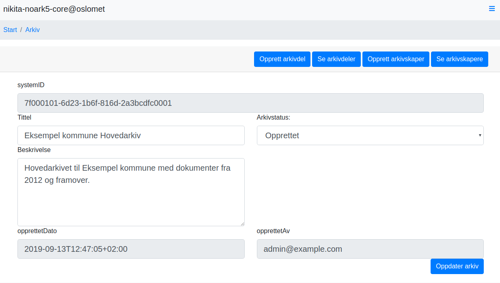

# Nikita og Noark 5 tjenestegrensesnittet tilbyr ny måte å tenke arkivering

av Thomas Sødring (OsloMet) og Petter Reinholdtsen (foreningen NUUG)

Nikita Noark 5-kjerne er et fri programvareprosjekt som tar i bruk
Arkivverkets spesifikasjonen for Noark 5 Tjenestegrensesnitt og tilbyr
et maskinlesbar grensesnitt (arkiv-API) for datasystemer som trenger å
arkivere dokumenter og informasjon. I tillegg tilbyr Nikita et
nettleserbasert brukergrensesnitt for brukere av arkivet. Dette
brukergrensesnittet benytter det maskinlesbare grensesnittet. Noark 5
Tjenestegrensesnitt er en ny måte å tenke arkivering, med fokus på
automatisering og maskinell behandling av arkivmateriale, i stedet for
å fokusere på brukergrensesnitt. En kan tenke på tjenestegrensesnittet
som arkivet uten brukergrensesnitt, der flere aktører kan koble til
ulike brukergrensesnitt, tilpasset ulike behov.

Historisk sett gjorde Noark en veldig bra jobb med overgangen fra
papir til digital saksbehandling, men det har kommet til kort på andre
områder. Den teknologiske utviklingen har brakt oss ditt av vi kan og
skal forvente langt mer fra en arkivkjerne enn før, men det offentlig
er ofte konservativ når det gjelder nytenking. For lengst skulle
begreper som samvirke mellom datasystemer, metadata, prosess og
tjenestegrensesnitt (API) vært dominerende når systemer kjøpes
inn. Dessverre er det slik at ikke alle ønsker samvirke mellom
datasystemer velkommen, og det kan oppleves trygt å kjøpe svarte
bokser der du slipper å ta stilling til hvordan man skal få flere
systemer til å virke sammen. Men IT-arkitektur er et begrep arkivfolk
også begynner å ta inn over seg.

# Billigere kobling mot arkiv

Slike systemer for å organisere metadata bør ha nettbaserte
tjenestegrensesnitt der brukergrensesnitt er tydelig adskilt fra
bakenforliggende system. Det finnes mange rapporter som snakker om å
bryte ned siloer i forvaltningen og standardiserte tjenestegrensesnitt
er det viktigste virkemiddel mot datasiloer og legger til rette for
økt samvirke mellom systemer. Et standardisert tjenestegrensesnitt er
et viktig middel for å få systemer til å samhandle da det sikrer at
ulike produsenters systemer kan snakke sammen på tvers. Samfunnet
fungerer ikke uten standardisering. Vi har alle samme strømstyrke og
kontakter i veggene og kjører alle på høyre side. Det er i en slik
sammenheng at prosjektet «Noark 5 Tjenestegrensesnitt» er veldig
viktig. Hvis alle leverandører av arkivsystemer forholdt seg til et
standardisert tjenestegrensesnitt kunne kostnadene for arkivering
reduseres.

Tenk at du er en kommune som ønsker et fagsystem integrert med
arkivløsningen din. I dag må fagsystemleverandøren vite og tilpasse
seg den spesifikke versjonen og varianten av arkivløsningen du
har. Hvis vi antar at alle leverandører av arkivkjerner har solgt inn
enten SOAP eller REST-grensesnitt til kunder de siste 10 årene og det
kommer endret versjon av grensesnittet innimellom så gir det veldig
mange forskjellige tjenestegrensesnitt en fagsystemleverandør må
forholde seg til. Med 12 leverandører og kvartalsvise oppdateringer
kan det potensielt bli 96 ulike varianter hvert eneste år. Det sier
seg selv at det blir dyrt. Men det blir faktisk verre. Hvis du senere
ønsker å bytte ut arkivsystemet med et annet så er du avhengig å få
alle integrasjonene dine laget på nytt. Dette kan gjøre at du velger å
forbli hos en dårlig leverandør framfor å skaffe nytt system, fordi
det blir for vanskelig og dyrt å bytte. Dermed etableres det små
monopolsituasjoner som er vanskelig å bryte ut av. Dårlige valg i dag
kan ha uante kostander på sikt.

I Nikita-prosjektet har vi kun jobbet opp mot Noark 5
Tjenestegrensesnittet. Det har tatt en god del ressurser å sette seg
inn i spesifikasjonen og ta den i bruk, spesielt på grunn av
uklarheter i spesifikasjonen. Hvis vi måtte gjøre det samme for alle
versjoner og varianter av de forskjellige tjenestegrensesnittene ville
det blitt veldig dyrt.

## Odata

For deg som arkivar er digitalisering og systemer som skal virke
sammen en del av den nye hverdagen. Du har kanskje blitt skånet for
det ved å kjøpe svarte bokser, men du risikerer at du gjør deg selv en
bjørnetjeneste. Det kan oppleves som kjedelig å fortelle kolleger at
du skal sette deg inn i et tjenestegrensesnitt, men dette er faktisk
veldig spennende.

Tjenestegrensesnittet er på en måte blitt levende og det er spesielt
et begrep du bør merke deg: OData. Å trekke inn deler av
OData-standarden som en måte å filtrere entitetsøk i et arkivsystem
var et nyttig trekk i prosjektet. Følgende eksempel er en
OData-spørring det går an å sende inn til en standardisert
arkivkjerne:

```
.../sakarkiv/journalpost?filter=contains(tittel, 'nabovarsel')
```

Spørringen over vil hente en liste av alle dine journalposter der
tittelen til journalposten inneholder ordet 'nabovarsel'. Alle
leverandører som implementerer tjenestegrensesnittet vil måtte tilby
dette. Det betyr at hvis du lærer dete språket for et system, vil det
være gjeldende for alle. Dette er egentlig en nye måte å søke i
arkivdatabasen på og vil være svært nyttig, for eksempel kan søk i
tjenestegrensesnittet antagelig brukes til å hente ut offentlig
postjournal. I arkivverden pleier vi å like teknologier som er
menneskelesbart, da vet vi det er enkelt og nyttig! OData er også
viktig fordi det kan bli en ny måte å svare innsynsforespørsler på i
tråd med offentlighetsloven § 9, der retten til å kreve innsyn i
sammenstilling fra databaser er nedfelt. I dag ser vi
forvaltningsorganer som avviser slike krav fordi det «ikke kan gjøres
med enkle framgangsmåter». Bruken av OData i tjenestegrensesnittet,
sammen med maskinlesbar markeringsformater kan være et viktig bidrag
til å åpne arkivene i tråd med prinsippene om en åpen og transparent
forvaltning.

# Entydig og klar standard sikrer samvirke

Standardisering er viktig fordi det kan sikre samvirke. Men den
effekten kommer kun hvis standardiseringen sikrer at alle forstår
standarden på samme måte, dvs. at den er entydig og klar. En god måte
å sikre en entydig og klar spesifikasjon er ved å kreve at det finnes
minst to ulike implementasjoner som følger spesifikasjonen og som kan
snakke sammen, det vil si at de snakker samme språk, slik IETF krever
for alle sine standarder, før spesifikasjonen anses å være ferdig.

Tilbakemelding fra miljøet forteller at både leverandører og kunder
har et avslappet forhold til Noark 5 Tjenestegrensesnitt og det er så
langt kun Evry som har visst offentlig at de har en implementasjon av
tjenestegrensesnittet. For å redusere kostnadene for samvirkende
datasystemer betraktelig, er det veldig viktig at vi kommer i en
situasjon der alle leverandører har sine egne implementasjoner av
tjenestegrensesnittet, og at disse oppfører seg likt og i tråd med det
som er beskrevet i spesifikasjonen.  Det er er her fri programvare
spiller en viktig rolle. Med en uklar standard blir det som en polsk
riksdag, der ingenting fungerer. Nikita er en fri
programvareimplementasjon av tjenestegrensesnitt og kan fungere som
teknisk referanse slik at leverandører enklere kan se og forstå
hvordan standarden skal tolkes. Vi har i Nikitaprosjektet erfart å
ende opp med vidt forskjellige tolkninger når prosjektmedlemmene leser
spesifikasjonsteksten, en effekt av en uklar spesifikasjon. Men
Nikitaprosjektet har også utviklet et test-program som sjekker om et
tjenestegrensesnitt er i samsvar med standarden, og prosjektet bruker
det hele tiden for å sikre at endringer og forbedringer
fungerer. Egenerklæringsskjemaenes dager kan væræ talte! Snart vil du
selv kunne teste hver oppdatering av arkivsystemet med en uavhengig
sjekk.

# Fri programvare sikrer innsyn og kontroll

Fri programvare representerer en demokratisering av kunnskap der
tolkning- og innlåsingsmakt flyttes fra leverandør til almenheten. Med
fri programvare har du en litt annerledes verdikjede, der selve
produktet ikke holdes hemmelig for å tjene penger, slik en gjør med
ufri programvare og skytjenester som ikke bruker fri programvare, men
du kan tjene penger på andre deler av verdikjeden. Med fri programvare
kan samfunnet betale for å videreutvikle nyttig fellesfunksjonalitet.
Nikita er en fri programvareimplementasjon av tjenestegrensesnittet og
kan fungere som en referanseimplementasjon dersom det er
ønskelig. Alle har lik tilgang til koden og det koster ingenting å ta
den i bruk og utforske det.

Nikitaprosjektet ønsker tjenestegrensesnittet velkommen og stiller
veldig gjerne opp i diskusjoner om tolkning av
tjenestegrensesnittet. Nikita er bygget på moderne
programmeringsrammeverk og utviklet i full åpenhet. Men nikita er ikke
noe du kankjøpe. Nikita er først og fremst et verktøy for forsking og
utvikling laget for å fremme forskning på arkivfeltet. Systemer som
virker sammen har alltid vært hovedfokus og vil være det fremover. Det
brukes som undervisningsverktøy der studentene ved OsloMet lærer om
administrativ oppsett, saksbehandling, uttrekk og samvirkende
datasystemer. Det brukes også som forskningsobjekt der vi ser på
import av dokumentsamlinger, bruk av blokkjede og andre nyskapende
måter å tenke arkiv på. Det er dog helt greit om andre tar Nikita og
pakker det for å selge det som produkt.

Forvaltningsorganer med sterke drift- og utviklingsmiljøer kan også se
på Nikita og utforske hva som er mulig. Dette kan de gjøre uten å
måtte betale for bruksrettigheter eller tilgang til konsulenter.  Men
arkivering blir ikke gratis på grunn av Nikita. Det trengs fortsatt
folk med kompetanse og tid til å ta i bruk Nikita.  Nikita har nylig
kommet med en ny utgave, den sjette i rekken. Systemet er ikke ferdig,
mest på grunn av at API-spesifikasjonen for Noark 5
Tjenestegrensesnitt ikke er ferdig, men allerede i dag kan en bruke
Nikita som arkiv.

# Import og eksport av deponi-XML

Vi har laget eksempelsystem for å importere data fra deponi-XML og
slik gjøre eksisterende arkivdata tilgjengelig via et API. Vi har også
laget en testklient som importerer epost inn i arkivet med vedlegg der
epostenes trådinformasjon brukes til å legge eposttråder i samme
arkivmappe, og en annen testklient som henter epost ut av en
arkivmappe på mbox-format slik at en vanlig epostklient kan brukes til
å lese igjennom og svare på epostene i en arkivmappe. De som vil ta en
titt på Nikita kan besøke https://nikita.oslomet.no og logge inn med
brukernavn «admin@example.com» og passord «password». Dette gir
tilgang til det forenklede brukergrensesnittet som brukes til
undervisning. De som heller vil ta en titt under panseret kan besøke
https://nikita.oslomet.no/browse.html og der se hvordan API-et
fungerer mer i detalj.  Innloggingsdetaljer her er det samme som for
brukergrensesnittet.

# Test fremtiden med Nikita

Fremover er fokuset på forbedring av spesifikasjonen Noark 5
Tjenestegrensesnitt. De som skrev tjenestegrensesnittet gjorde et
interessant og framtidsrettet grep, de skilte sak fra arkiv.
Tjenestegrensesnittet består av flere "pakker", der noen er
grunnleggende mens andre bygger på de grunnleggende pakkene. Pakkene
som er beskrevet så langt heter «arkivstruktur», «sakarkiv»,
«administrasjon», «loggogsporing» og «moeter». Etter hvert håper vi å
utforske prosses- og metadatabeskrivelser til flere fagområder og
bidra til at tjenestegrensesnittet kan legge til flere pakker som
«byggarkiv», «barnevern», «personal», «barnehage», der arkivfaglig
metadata- og dokumentasjonsbehov er kartlagt og standardisert.

Nikita utvikles av en liten prosjektgruppe, og vi er alltid
interessert å bli flere. Hvis en åpen, fri og standardisert tilnærming
til arkivering høres interessant ut, bli med oss på veien videre. Vi
er tilstede på IRC-kanalen #nikita hos FreeNode (tilgjengelig via
nettleser på https://webchat.freenode.net?channels=#nikita), og har en
e-postliste nikita-noark@nuug.no hos NUUG (tilgjengelig for påmelding
og arkiv på https://lists.nuug.no/mailman/listinfo/nikita-noark) der
en kan følge med eller være med oss på den spennende veien videre.

## fremhevet sitater til teksten

**Den teknologiske utviklingen har brakt oss ditt av vi kan og skal forvente langt mer fra en arkivkjerne enn før**

**OData er også viktig fordi det kan bli en ny måte å svare innsynsforespørsler på i tråd med offentlighetsloven § 9**

**Fri programvare representerer en demokratisering av kunnskap der tolkning- og innlåsingsmakt flyttes fra leverandør til almenheten.**

# Figurer



{width=80%}
