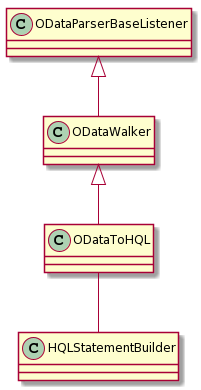

# OData

The Noark5 API requires the implementation of the OData standard for metadata search. 

## Related resources

  * [OData ABNF construction rules](https://docs.oasis-open.org/odata/odata/v4.0/errata02/os/complete/abnf/odata-abnf-construction-rules.txt)
  * [MySQL grammar in ANTLR 4](http://blog.ptsecurity.com/2018/01/mysql-grammar-in-antlr-4.html) 
  * [OData cheatsheet](https://help.nintex.com/en-us/insight/OData/HE_CON_ODATAQueryCheatSheet.htm)

## OData limitations

OData enables a SQL-like approach to search in REST endpoints. It is not a search engine index
and does not provide content based retrieval for documents. It is limited by SQL in terms of 
developing recursive searches when trying to search the archive for a single term. 

## Nikitas OData implementation

Nikita implements support for OData using antlr4. If you want to see how we have implemented OData please take a look at *ODataLexer.g4* and *ODataParser.g4*. These are originally adapted from the MySQL antlr4 descriptions. 

The class NikitaODataWalker contains the main functionality for parsing. There are a number of subclasses (NikitaODataToHQLWalker, NikitaODataToSQLWalker and NikitaODataToESWalker). Currently, nikita is only actively developing the HQL version. The others are documentation showing how it could be possible to extend the base class for OData translation.

The queries our OData implementation supports are documented in TestOData.java.
 
## Escaping
The client will need to URL-encode the URL. This is outside the scope of the OData handling as spring gives the ODataController a decoded URL. Our code does not handle URL-decode the URL. Our code does unescape some parts of the OData query where necessary.  

## The underlying model
There are three layers of inheritance at play in the implementation. The first is `ODataWalker` that
extends the antlr auto-generated `ODataParserBaseListener`. ODataWalker walks the tree and calls various
process methods that are implemented in the sub-classes. For example, when processing OData to HQL,  `ODataWalker::enterTopStatement` results in a call to `ODataToHQL::processTopCommand`. ODataToHQL has
an instance of `HQLStatementBuilder` that can be used to construct the HQL command. This is shown in the image below.


There are partial implementations for SQL and ElasticSearch query language, but these are not under active development. 


https://docs.microsoft.com/en-us/aspnet/web-api/overview/odata-support-in-aspnet-web-api/odata-v4/complex-type-inheritance-in-odata-v4
https://github.com/simple-odata-client/Simple.OData.Client/issues/622
https://docs.microsoft.com/en-us/odata/webapi/abstract-entity-types
https://me.zhuoyue.me/2016/10/28/odata-v4-web-api/
https://www.odata.org/getting-started/basic-tutorial/
https://docs.microsoft.com/en-us/dotnet/api/overview/odata-dotnet/

## Handling IN queries

The API spec identifies the following query as a valid query it should be possible to search with:

    ../api/arkivstruktur/mappe?$filter=klasse/klasseID eq '12/2' and klasse/klassifikasjonssystem/klassifikasjonstype/kode eq 'GBNR' 

I am unsure if the second part is a valid OData query

    klasse/klassifikasjonssystem/klassifikasjonstype/kode eq 'GBNR'

The query basically says that we must find all klassifikasjonssystem that are of type 'GBNR' that a klasse entity is connected to. As it stands I am not sure how to approach such a query, so we are leaving it for now and will concentrate on implementing the easier example:

    klasse/klasseID eq '12/2'

So we are looking at undertaking a query like:
    
    ../api/arkivstruktur/Mappe?$filter=klasse/klasseID eq '12/2'
    
I believe this is an IN query         

SQL (Norwegian Noark names) :

    select * from mappe where mappe.referanseKlasse IN     
          (select systemID from klasse where klasseID = '12/2')     

SQL (English nikita names) :

   
    select * from as_file where as_file.file_class_id IN     
          (select system_id from as_class where class_id = '12/2') 

It is not clear to me how to construct a generic approach (OData to S/HQL) to
 create the query. It is straightforward to pick up the *klasse/klasseID eq '12/2'*
 and handle it as *"klasse/klasseID"* can be parsed as entity/attribute and then
 the code dealing with the parser details can turn *"klasse/klasseID"* into a 

      IN (select SOMETHING from as_class where class_id = '12/2')

The *SOMETHING* is the issue here as outside of our Noark context, it is not
possible to know what *SOMETHING* is. But within the Noark/nikita context it
is not a problem to figure out that *SOMETHING* is system_id. We can even add
a method to the @Entity classes that pulls out the name of the primary key or 
it may be possible to do via reflection. 

The previous part is also difficult to solve 
   
    select * from as_file where as_file.file_class_id IN

The @Entity class does not contain any useful methods that can help solve this
issue. So reflection is used. To find the foreign key from as_file to
as_class reflection can be used to identify the @OneToMany, @ManyToOne, @OneToOne and
@ManyToMany relationships. 

```
  Field[] allFields = klass.getDeclaredFields();
  for (Field field : allFields) {
    if (field.getAnnotation(Id.class) != null) {
       // Found the primary key
    }
    if (field.getAnnotation(ManyToOne.class) != null) {
       // Found a Many to One relationship
    }
    if (field.getAnnotation(OneToMany.class) != null) {
       // Found a One To Many relationship
    }

```

Note. This approach requires that foreign keys are annotated. That limitation 
makes sense in a hibernate world, but might limit the approach in other 
contexts.

```
    if (field.getAnnotation(OneToMany.class) != null) {
      Class[] interfaces = field.getType().getInterfaces();
      for (Class iface : interfaces) {
        if (iface.isAssignableFrom(Collection.class)) {
          // The variable type has Collection as base class
        }
      }
    }
```

The next step involves getting the signature class of the collection. Due to
*type erasure*, this information is not available. However, it is possible to
find it by looking at the getter method for the variable.

```
  Type genericReturnType = method.getGenericReturnType();
  if (genericReturnType instanceof ParameterizedType) {
      for (Type type :
              ((ParameterizedType) genericReturnType)
                      .getActualTypeArguments()) {
          java.lang.Class returnType = (java.lang.Class) type;
          if (returnType.getSimpleName()
                  .equals(className)) {
              return variableName;
          }
      }
  }
```

There are two caveats to this approach. The first is that it requires that the
getter exists and that is uses the same name as the variable after the get
part of the method name (getSeries). Nikita generally uses an approach 
getReferenceVariableName, but in some cases we might have used getVariableName.
As such, both approaches must be supported. These are not really caveats as I 
think we can reasonably expect the getters exist and follow a standardised
approach to naming.  

This approach is a little excessive as we could just make sure all nikita 
@Entity class with a @OneToMany foreign name the variable reference'Object'. I think that 
approach is too simple and starts creating requirements on the domain model.
However, the same can be argued about using the @OneToMany. So this is just an
exploration of possible approaches to solving this issue.

It is likely however that we do need to be able to pick out primary keys so 
using reflection to find the primary key is required. But most of our primary 
keys are called systemId and annoted with @Id. This is not the case for the
metadata entities that have a 'code' name for the primary key.  

```
    public String getPrimaryKey() {
        Field[] allFields = FieldUtils.getAllFields(this.getClass());
        for (Field field : allFields) {
            if (field.getAnnotation(Id.class) != null) {
                System.out.println("Id class is: " + field.getName());
                return field.getName();
            }
        }
        return "";
    }
```

While the previous OData query example is relevant, other more relevant query perhaps to 
explore is based on the national identifiers. Some example national identifier queries:

       api/arkivstruktur/Mappe?$filter=bygning/bygningsnummer eq 10 and bygning/endringsloepenummer eq 20
       api/arkivstruktur/Mappe?$filter=matrikkel/kommunenummer eq '110' and matrikkel/gaardsnummer eq 22 and matrikkel/bruksnummer eq 12
       api/arkivstruktur/Mappe?$filter=posisjon/x eq 1.233 and posisjon/y eq 9.233 and posisjon/y eq 22.45  
       api/arkivstruktur/Mappe?$filter=plan/planidentifikasjon eq 'min super plan' and plan/fylkesnummer eq '23' 
       api/arkivstruktur/Mappe?$filter=foedselsnummer eq '010182121212'
       api/arkivstruktur/Mappe?$filter=dnummer eq '123456789' 

Solving these with IN clauses may also be straightforward, however foedselsnummer and dnummer appear to both be an entity and attribute at the same time. Unless there is an entity/attribute description for national identifiers, the parsing code will assume that foedselsnummer is an attribute belonging to mappe and not a foreign key reference. Therefor we will have to have some kind of entity identifier. Two approaches quickly pop to mind.

1. Same name for entity and attribute   


        api/arkivstruktur/Mappe?$filter=foedselsnummer/foedselsnummer eq '010182121212'
        api/arkivstruktur/Mappe?$filter=dnummer/dnummer eq '123456789' 

2. nasjonalidentifikator as entity name


       api/arkivstruktur/Mappe?$filter=nasjonalidentifikator/foedselsnummer eq '010182121212'
       api/arkivstruktur/Mappe?$filter=nasjonalidentifikator/dnummer eq '123456789'        

I don't need to solve this approach right now, but we should take a look at this soon.       
       
## Known problems in our implementation

### Lexer problem

The following OData query can be parsed:

    arkivstruktur/mappe?$filter=klasse/klasseID eq '12'

but this one causes a warning  / console message

    arkivstruktur/mappe?$filter=klasse/klasseID eq 12

The parser is picking 12 up as an INTEGER rather than as an *ID* or *QUOTED_STRING*

    line 1:47 mismatched input '12' expecting {ID, QUOTED_STRING}
    
This is related to the way the lexer sees INTEGER defined first and passing 12 as an integer to the 
parser rather than a literal or quoted literal. There is no point in spending days now trying to fix
this, so I am documenting this, so we can revisit it later.     